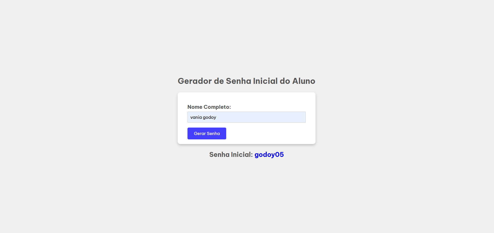

# Gerador de Senha do Aluno 🛠️

Este é um projeto simples que gera uma senha inicial para alunos com base no sobrenome e no número de vogais do nome completo informado. O objetivo principal é validar o preenchimento de um nome completo e exibir a senha gerada de forma estilizada.

## 🚀 Funcionalidades

- **Validação do Nome Completo**: Certifica-se de que o nome informado contém pelo menos um nome e um sobrenome.
- **Geração de Senha**: A senha inicial é formada pelo sobrenome (em letras minúsculas) seguido do número de vogais do nome completo.
- **Exibição Personalizada**: O texto "Senha inicial" aparece com estilo diferenciado e a senha é destacada em azul.

## 🖥️ Tecnologias Utilizadas

- **HTML**: Estrutura do formulário e layout básico.
- **CSS**: Estilização da interface, com foco em um design minimalista e responsivo.
- **JavaScript**: Lógica de validação, processamento do nome e geração da senha.

## Autor

- **GitHub:** [Vania Godoy ♥](https://github.com/seu-usuario)